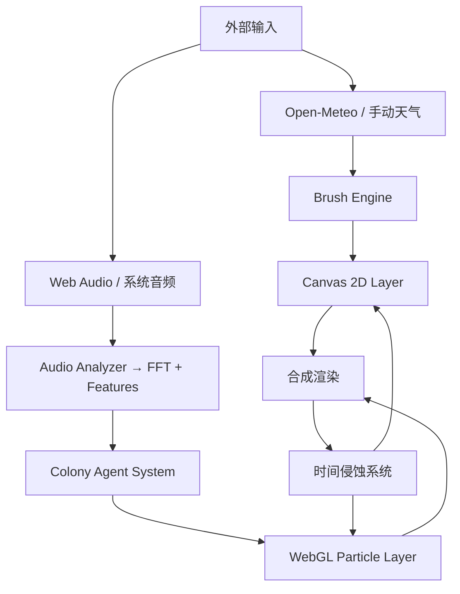

**✅ 已准备好**

以下是 **Mycelium Ink** 的 **技术方案设计文档 (TDD) v1.0**，严格基于 PRD v1.2 撰写。

---

```markdown
# Mycelium Ink 技术方案设计文档 (TDD)

**版本**：v1.0  
**日期**：2026-05-29  
**对应 PRD**：v1.2  
**状态**：草案

---

## 1. 文档目的

本文档将 PRD 中的产品需求转化为具体的技术实现方案，定义系统架构、模块划分、关键技术选型、数据流、性能策略及跨平台实现细节，为开发提供可直接执行的蓝图。

---

## 2. 系统架构概述

### 2.1 整体架构（分层设计）

```
+------------------+     +---------------------+
|   平台适配层     |<--->|   共享核心层 (Core)  |
| (Web / Electron) |     |  (纯 TypeScript)    |
+------------------+     +---------------------+
                               |
                               v
                    +---------------------+
                    |   渲染引擎层         |
                    | Canvas 2D + WebGL 2 |
                    +---------------------+
                               |
                               v
                    +---------------------+
                    |   资源与持久化层     |
                    | localStorage / IDB  |
                    +---------------------+
```

### 2.2 技术栈

- **语言**：TypeScript 5.6+
- **构建工具**：Vite 6
- **核心框架**：无框架（Vanilla TS + 极少量状态管理）
- **渲染**：
  - 书法层：Canvas 2D（原生 + requestAnimationFrame）
  - 菌落层：WebGL 2（原生或轻量封装，如 twgl.js / raw WebGL）
- **音频**：Web Audio API + AudioWorklet（高性能 FFT）
- **桌面端**：Electron 28+
- **状态管理**：轻量 Zustand / nanostores 或自定义 EventEmitter
- **数学/噪声**：Simplex Noise（或 perlin），glMatrix / 自定义向量库

---

## 3. 模块划分（Monorepo 结构）

```
mycelium-ink/
├── packages/
│   └── core/                    # 共享核心（最重要）
│       ├── src/
│       │   ├── weather/         # 天气数据 + 映射
│       │   ├── brush/           # 书法引擎
│       │   ├── colony/          # 菌落 Agent 系统
│       │   ├── audio/           # 音频分析器
│       │   ├── timeline/        # 氧化 & 层积时间线
│       │   ├── renderer/        # 渲染抽象接口
│       │   ├── utils/           # 向量、噪声、数学
│       │   └── types.ts
│       └── index.ts
├── apps/
│   ├── web/                     # 网页端（Vite + PWA）
│   └── desktop/                 # Electron 主进程 + 渲染进程
└── design/                      # 设计资产
```

---

## 4. 核心数据流



---

## 5. 关键模块详细设计

### 5.1 天气映射模块 (`weather-brush.ts`)
- 输入：`WeatherData { temp, humidity, windSpeed, pressure }`
- 输出：`BrushParams`（墨浓度、晕染半径、抖动、飞白概率、字重等）
- 实现映射公式（PRD 6.1），增加平滑过渡（lerp）

### 5.2 书法生成引擎
- 使用 Canvas 2D Path2D + 自定义笔刷模拟
- 真实运笔：贝塞尔曲线 + 压力模拟（速度 → 粗细）
- 飞白：随机中断 + 纹理采样
- 内容生成：词库 JSON + 简单排版算法（竖排优先）

### 5.3 音乐菌落引擎（核心难点）
- **Agent 模型**：每个粒子为有限状态机（SEED → GROWING → MATURE → DECAY → DUST）
- 使用对象池 + TypedArray 优化性能
- 寻路：简化 A* 或距离场 + 趋墨性向量
- 物理：Verlet 积分或简单 Euler 积分

### 5.4 渲染管线（双层合成）

**每帧流程**：
1. 更新书法层（仅在书写或层积时重绘）
2. 更新 WebGL 粒子位置、生命周期、颜色
3. WebGL 渲染到透明纹理
4. CSS `mix-blend-mode: multiply` 或 `overlay` 合成最终画面

**性能优化**：
- 书法层使用 OffscreenCanvas（Worker 渲染书写）
- WebGL 使用 Instanced Drawing（大量相同菌落形状）

---

## 6. 性能策略

- **动态 LOD**：根据设备性能自动调整粒子上限和模拟频率
- **分帧模拟**：重计算（如氧化）分散到多帧
- **内存管理**：定期 GC 死亡粒子、合成为静态纹理
- **WebGL 降级**：检测 `WebGL2` 支持失败 → 切换 Canvas 2D 粒子模式（上限 1500）

---

## 7. 跨平台抽象

```typescript
interface AudioSource {
  start(): Promise<void>;
  stop(): void;
  getFrequencyData(): Float32Array;
  // ...
}

interface PlatformAdapter {
  captureSystemAudio(): Promise<MediaStream | null>;
  exportVideo(...): Promise<void>;
}
```

- Web 端与 Desktop 端实现不同 `AudioSource`

---

## 8. 天气降级策略实现

严格按照 PRD 5.4 流程图实现：
- `WeatherService` 类统一接口
- 失败重试 + 指数退避
- 本地缓存使用 IndexedDB（支持时间戳）

---

## 9. 关键技术风险与应对

| 风险 | 应对方案 |
|------|----------|
| WebGL 粒子性能 | 对象池 + Instanced + TypedArray + LOD |
| 长时间运行内存泄漏 | 严格对象池 + 定期 dispose + 纹理复用 |
| 不同设备书写手感差异 | 基于物理时间的固定模拟步长 |
| Electron 打包体积 | Tree-shaking + 动态 import + 压缩 |

---

## 10. 非功能实现要点

- **PWA**：`vite-plugin-pwa` + Service Worker 缓存核心资源
- **离线**：保存最后一次天气 + 手动模式
- **可访问性**：键盘快捷键 + 屏幕阅读器友好（全屏模式例外）
- **可扩展性**：所有映射使用配置表，便于后续 MIDI / LLM 接入

---

## 11. 下一步行动计划

1. 完成核心原型（M1）—— 天气滑块 + 书法 + 简单菌落
2. 实现共享 Core 包 + 单测覆盖关键映射
3. 搭建 Web 端基础框架 + 渲染管线
4. 性能基准测试（低端设备）

---

**文档结束**
```
